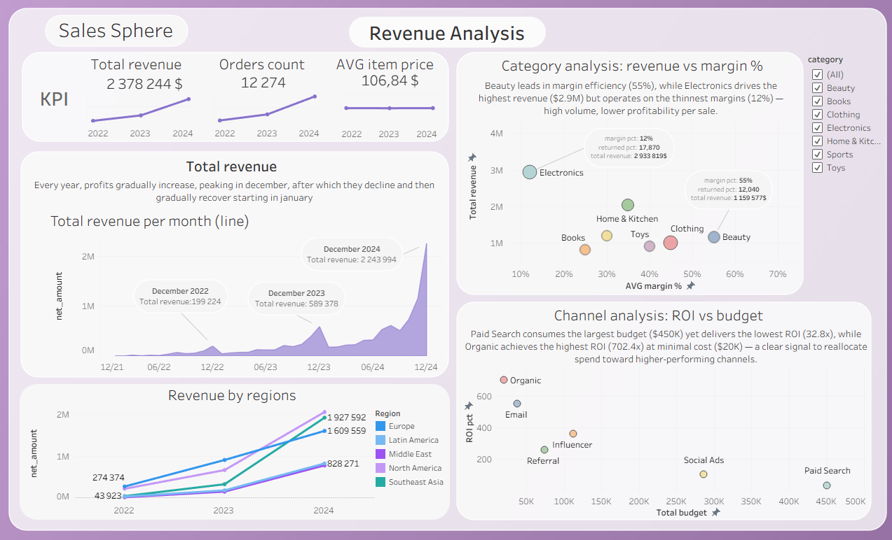
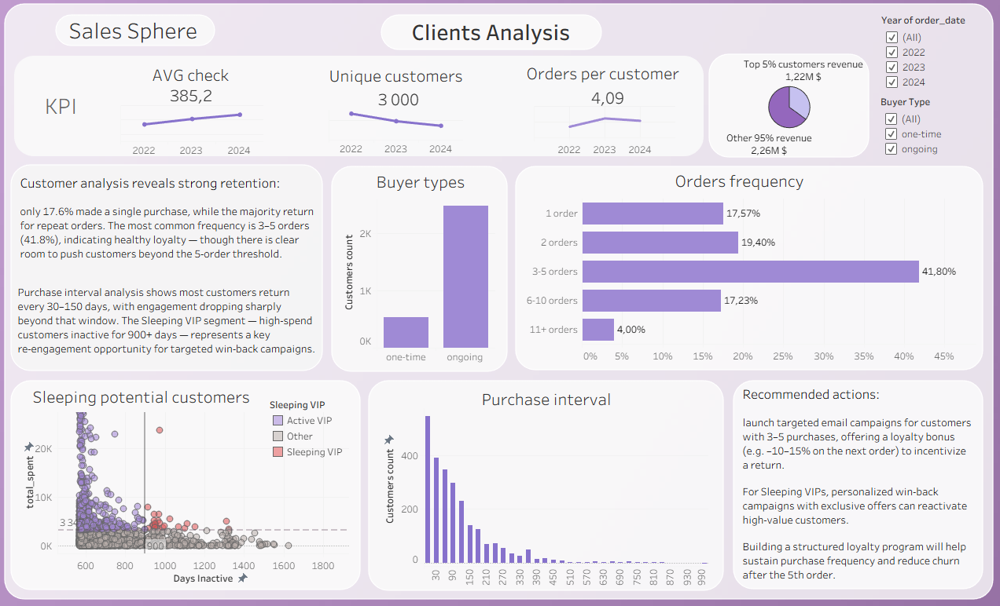

# Shop Sphere Analysis - SQL queries & visualisation
Project involving the cleaning of a “dirty” dataset of cafe sales.
The goal is to practice data wrangling using realistic data that contains missing values and errors.

## About dataset

The dataset simulates a global e-commerce marketplace operating from 2022 to 2024. It covers 3,000 customers spread across five regions — North America, Europe, Southeast Asia, Latin America, and the Middle East — and includes over 12,000 orders and 26,000 line items across 7 product categories. Each customer has an acquisition channel and signup date, and each order contains pricing, discount, device, and return information.

The data is spread across 5 related tables connected via customer, order, and product IDs. The marketing table adds campaign-level context with budget, impressions, clicks, and attributed revenue across 6 channels. A subset of orders from June 2024 onward includes an A/B variant flag, used for checkout redesign experimentation.

## Project structure
    ├── data/

    │ └── shopsphere_customers.csv

    │ └── shopsphere_marketing.csv
  
    │ └── shopsphere_order_items.csv

    │ └── shopsphere_orders.csv
  
    │ └── shopsphere_products.csv

    ├── notebooks/

    │ └── shopsphere_tests.ipynb

    |── tasks/

    │ └── task.md

    │ └── task_medium.md
  

    └── README.md

    └── report.md

    └── requirements.txt

## Visualization

.png)
.png)

## Main insights

## Installation 
    pip install -r requirements.txt
