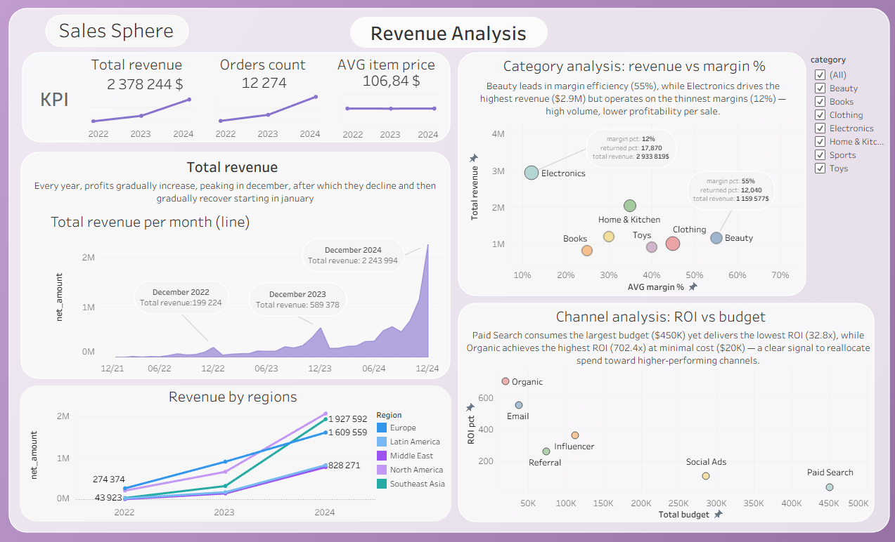
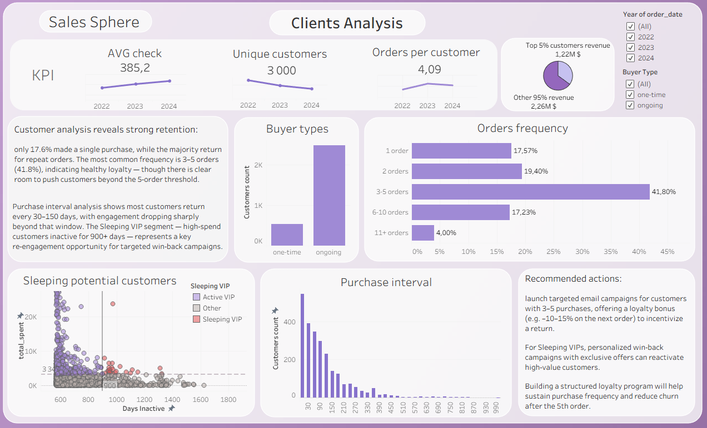

# Shop Sphere Analysis - SQL queries & visualisation
Project involving the cleaning of a “dirty” dataset of cafe sales.
The goal is to practice data wrangling using realistic data that contains missing values and errors.

## About dataset

The dataset simulates a global e-commerce marketplace operating from 2022 to 2024. It covers 3,000 customers spread across five regions — North America, Europe, Southeast Asia, Latin America, and the Middle East — and includes over 12,000 orders and 26,000 line items across 7 product categories. Each customer has an acquisition channel and signup date, and each order contains pricing, discount, device, and return information.

The data is spread across 5 related tables connected via customer, order, and product IDs. The marketing table adds campaign-level context with budget, impressions, clicks, and attributed revenue across 6 channels. A subset of orders from June 2024 onward includes an A/B variant flag, used for checkout redesign experimentation.

## Project structure
    ├── data/

    │ └── shopsphere_customers.csv

    │ └── shopsphere_marketing.csv
  
    │ └── shopsphere_order_items.csv

    │ └── shopsphere_orders.csv
  
    │ └── shopsphere_products.csv
    

    ├── foreecast_project/

    │ └── coffee_forecast.ipynb

    │ └── forecast_project.md
    
 
    ├── images

    │ └── clients_analysis_dashboard.png
    
    │ └── revenue_analysis_dashboard.png

    │ └── revenue_forecast(linear_regreession).png

    │ └── revenue_forecast(prophet).png
    
    
    ├── notebooks/

    │ └── shopsphere_tests.ipynb

    |── tasks/

    │ └── task.md

    │ └── task_medium.md
  

    └── README.md

    └── report.md

    └── requirements.txt

## Visualization

.png)
.png)

## Main insights
Marketing Efficiency: Organic delivered the highest ROI (702%), while Paid Search consumed the largest budget ($450K) with only 32% ROI. This suggests an opportunity to optimize marketing spend toward more efficient channels.

Product Profitability: Electronics generated the highest revenue (~$2.9M) but had the lowest profit margin (12%) and the highest return rate (17.8%). Beauty achieved the strongest margin (~55%), highlighting the importance of profitability over revenue alone.

Customer Value & Retention: The top 5% of customers generated 35% of total revenue. Only 17.6% of customers made a single purchase, indicating strong repeat-purchase behavior and opportunities for VIP loyalty programs.

Customer Segmentation: Influencer and Referral channels attracted high-value customers, with average LTVs of $1,985 and $1,791, respectively. High-value inactive customers were also identified as potential targets for reactivation campaigns.

A/B Testing: The redesigned checkout showed a slightly higher average order value ($287 vs. $282), but the difference was not statistically significant (p = 0.51). Further testing is needed before recommending implementation.

Revenue Forecasting: Linear Regression and Prophet were used to forecast revenue for the next 12 months. Prophet captured nonlinear patterns and seasonal fluctuations, while Linear Regression provided a simple baseline. The forecasts suggest continued growth, although uncertainty remains due to historical revenue volatility.

## Installation 
    pip install -r requirements.txt
