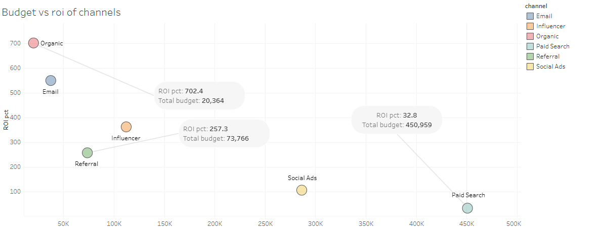
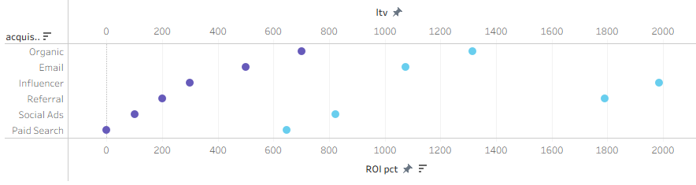
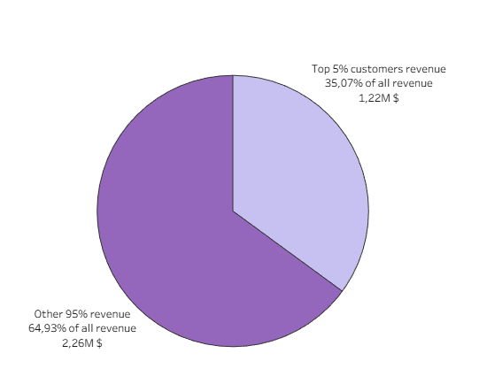
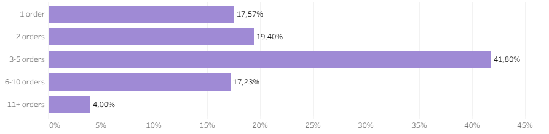
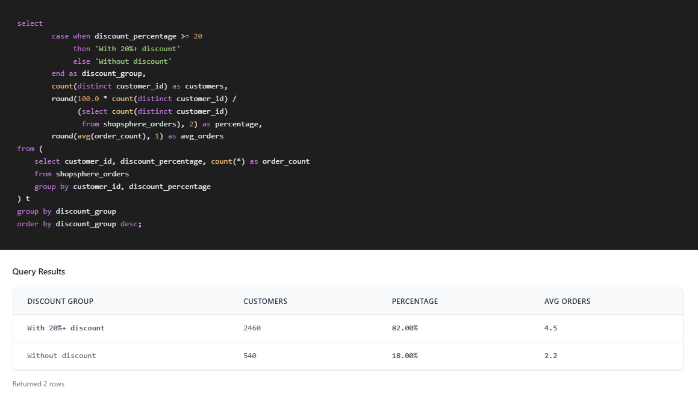
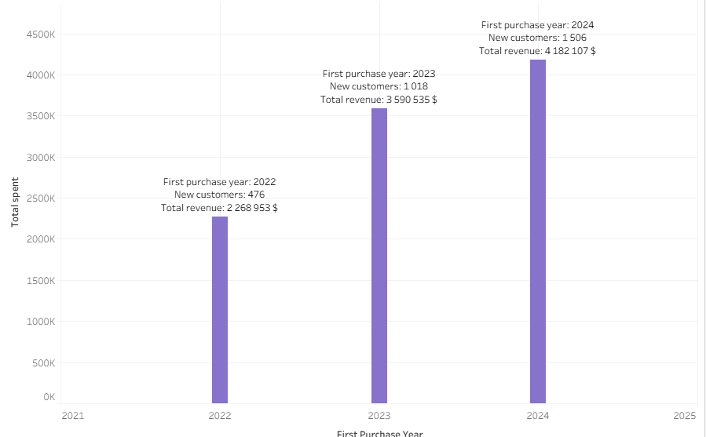
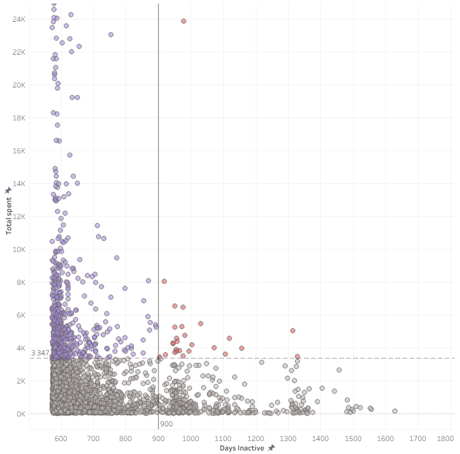
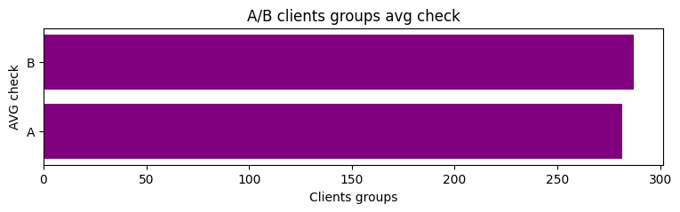
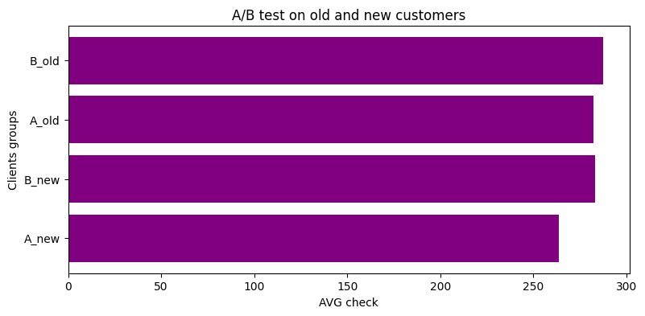
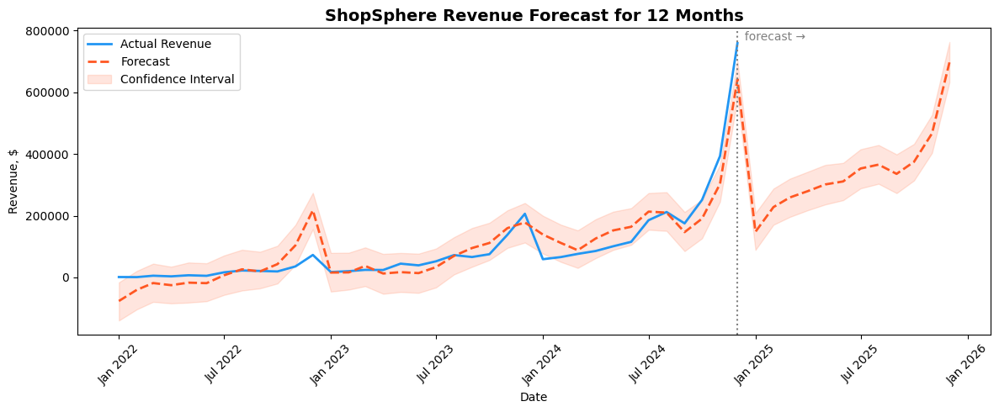

# ShopSphere Analytics #

E-Commerce Analysis Report · Emilian Pohorodnii · Junior Data Analyst
________________________________________________________________________________________

## 1. Analysis Objective

The goal of this project was to analyze the effectiveness of the ShopSphere e-commerce platform and find answers to four key business questions: where the marketing budget is being spent, who the most valuable customers are, which product categories are truly profitable, and whether the new checkout page design contributed to sales growth.

________________________________________________________________________________________

## 2. Data

The analysis is based on 5 CSV tables covering the period from 2022 to 2024. The dataset includes 3,000 customers, 12,274 orders, 26,068 order items, 250 products across 7 categories, and 216 marketing campaign records across 6 channels. Tables are connected via customer, order, and product IDs.

________________________________________________________________________________________

## 3. Methodology

Data was prepared and aggregated using SQL (SQLite) with JOINs and subqueries. Further analysis was done in Python using pandas for data manipulation, scipy for statistical testing, and Prophet for revenue forecasting. The A/B test was evaluated using an independent samples t-test. Visualizations were built in Tableau and matplotlib.

________________________________________________________________________________________

## 4. Results

## 4.1 Marketing Channel Performance

Organic is the most efficient channel with a 702% ROI at a budget of only $20K. Paid Search has the largest budget ($450K) but the lowest ROI (32%) — a clear sign of poor allocation.

When looking at customer lifetime value by channel, Influencer leads with an average LTV of $1,985, followed by Referral ($1,791). Paid Search brings in the lowest-value customers at $648 LTV — poor on both ROI and customer quality. ROI and LTV tell different stories, and both metrics matter.

________________________________________________________________________________________

## 4.2 Product Category Profitability

Electronics generates the highest revenue (~$2.9M) but has the lowest margin (12%) and the highest return rate (17.8%) — it creates an illusion of volume. Beauty has the highest margin (~55%) with a moderate return rate, making it the most profitable category per dollar sold. Sports has the lowest return rate (9%) and a solid margin of 30%.

________________________________________________________________________________________

## 4.3 Customer Segmentation

The top 5% of customers (150 people) generate 35% of total revenue ($1.2M), spending 7× more than the average buyer. Most of them came through Influencer or Organic channels.

Analysis of purchase frequency shows that only 17.6% of customers make a single purchase. The majority return, with activity peaking at 3–5 orders per customer. On average, an active customer places 4.8 orders with an interval of approximately 30 days between purchases. Customers with 2+ orders represent the highest lifetime value — they transition from one-time transactions to sustained loyalty, providing predictable recurring revenue.

Customers who buy mostly with discounts (average discount >20%) place twice as many orders on average (4.5 vs 2.2), which suggests they are price-sensitive but loyal when incentivized.

A cohort analysis by first purchase year shows consistent growth across all three cohorts: the 2022 cohort brought 476 new customers with $2.27M in revenue, 2023 — 1,018 customers and $3.59M, and 2024 — 1,506 customers and $4.18M. This indicates that the platform is successfully acquiring new customers at an accelerating rate, and each incoming cohort generates more total revenue than the previous one.

Additionally, a segment of at-risk customers was identified — buyers whose average spend is above the overall baseline but who have shown no activity for 300+ days. This group represents a high-value re-engagement opportunity that is currently being missed.

________________________________________________________________________________________

## 5. A/B Test — Checkout Redesign

The new checkout design (variant B) showed a slightly higher average order value ($287 vs $282), but the difference was not statistically significant (p = 0.51). Breaking down by customer type, new customers in group B spent $283 vs $263 in group A — a promising trend, but still not significant (p = 0.71). The experiment did not produce conclusive results.

For returning customers, the picture was similar: group B showed only a $5 difference over group A (p = 0.58) — also not statistically significant. Whether we look at the full sample or break it down by customer segment, the null hypothesis cannot be rejected in any case.

________________________________________________________________________________________

## Linear Regression forecast

Two forecasting models — Linear Regression and Prophet — were trained on two years of revenue data. Both models predicted revenue for the next 12 months, capturing seasonal fluctuations and the overall growth trend. The forecast confirms steady growth with peak values during the holiday season (November–December).

________________________________________________________________________________________

## 6. Recommendations

Paid Search consumes $450K at only 33% ROI. Reallocating 50% to Organic (702% ROI) and Referral (LTV $307) would immediately improve efficiency. Email at 215% ROI is already working — keep it. Social Media needs a rethink: lowest LTV at $201.

Electronics looks strong on revenue but delivers only 12% margin with the highest return rate. Beauty: 55% margin, low returns. The investment priority is clear.

Retention is solid — only 17.57% one-time buyers vs 60–70% industry average. The weak point is after the 2nd order, where 582 customers churn. A simple bonus on the 3rd purchase would fix this at the right moment. No need for constant discounts — 71.53% of orders already happen without them.

150 customers (top 5%) drive a disproportionate share of revenue. A VIP program — personal manager, early access, priority support — protects that concentration directly.

The A/B test on checkout (p = 0.51) was inconclusive across all segments. Rerun with 3× more users before making any design decision.
________________________________________________________________________________________

## 7. Limitations

The A/B test ran on a small sample for a short time, which is why the results were inconclusive. The dataset is fictional, so real-world data would likely be messier. The forecast is based on past patterns and won't be accurate if market conditions change.

ShopSphere Analytics Report · Emil Pohornii · 2024
